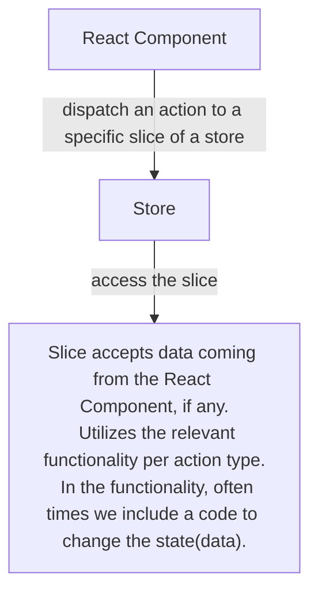

# Redux Toolkit

<hr>

- [Redux Toolkit](#redux-toolkit)
  - [Some Useful Links](#some-useful-links)
  - [Overview](#overview)
  - [Installation](#installation)
  - [Initialization with `createSlice`](#initialization-with-createslice)
  - [Initialization of the Redux store with `configureStore`](#initialization-of-the-redux-store-with-configurestore)
  - [Connecting the React app to the Redux store](#connecting-the-react-app-to-the-redux-store)
  - [Interacting with the Redux store from React Components](#interacting-with-the-redux-store-from-react-components)
  - [More elaborate example](#more-elaborate-example)
    - [Using the `prepare` callback](#using-the-prepare-callback)
  - [`CreateAsyncThunk`](#createasyncthunk)
    - [thunkAPI](#thunkapi)
  - [Middleware](#middleware)
  - [Notes on some of Redux-Toolkit's other methods](#notes-on-some-of-redux-toolkits-other-methods)
    - [`createAction`](#createaction)
    - [`createReducer`](#createreducer)
    - [`store.subscribe()`](#storesubscribe)

<hr>

## Some Useful Links

- https://daveceddia.com/what-is-a-thunk/
- https://typeofnan.dev/what-is-a-thunk/

<hr>

## Overview

Redux Toolkit is a library for state management. Briefly, this is how it works.

- We create a store, where we put some pieces, slices of data and functionality.
- Then, we connect our React app to that store.
- Then, we can interact with the state (data in the store) easily from any component of our React app.

This library helps to get rid of the **prop drilling**. It makes it easy to have access to the same set of data and functionality from every component.



## Installation

To install the Redux Toolkit we use the below code:

```shell
npm install @reduxjs/toolkit react-redux
```

The `@reduxjs/toolkit` is the name of the library. The `react-redux` is used to connect our React app with the Redux store.

## Initialization with `createSlice`

Let's learn Redux Toolkit by building a simple app. First, let's create a folder structure. Usually, we create a **features** folder, where we will initialize the slice.

> Slice in Redux Toolkit, is just a piece of code that our React app will be able to access. We usually create slices, and combine them in something called **store**. Thus, slices hold some of our data and the functionality to change the data. The store becomes the combination of various slices. We access the store, which further connects to a slice, and thus we get the data we need or change the data using the available functionality.

After creating the **features** folder, let's create a folder called **user**. Inside that folder, let's create `userSlice.js` file.

We use the `createSlice` method, to initialize the slice. We provide an object with

- `name`,
- `initialState`, and
- `reducers` properties to the slice.
  - The `reducers` property accepts reducer functions. These functions usually have 2 arguments: `state`, and `action`.
    - The `state` argument helps to interact with the state (data in the store). For example, we access the state, to get the value of a variable in a state or to change it.
    - The `action` argument, specifically its `payload` property, helps to receive the data that are dispached from components.

This is what the `createSlice` method returns:

```
{
  name: name of the slice
  reducer: combine reducer function
  actions: action creators extracted from the 'reducer' option
  caseReducers: reducer functions from 'reducers' option
}
```

Here is an example code in the `userSlice.js` file

```js
// features/user/userSlice.js
import { createSlice, nanoid } from "@reduxjs/toolkit";

const initialState = {
  id: nanoid(),
  name: "User Name",
  email: "email@example.com",
};

const userSlice = createSlice({
  name: "user",
  initialState,
  reducers: {
    changeName: (state, action) => {
      state.name += " changed";
    },
  },
});

export const { changeName } = userSlice.actions;

export default userSlice.reducer;
```

## Initialization of the Redux store with `configureStore`

After creating our slice, and exporting actions and the reducer from it, let's create our store. First, create the **app** folder, and inside that create the `store.js` file. We import the reducer from `userSlice.js` file, and `configureStore` from `@reduxjs/toolkit`. After creating the store, we export it.

```js
// app/store.js
import { configureStore } from "@reduxjs/toolkit";
import userReducer from "../features/user/userSlice";

const store = configureStore({
  reducer: {
    user: userReducer,
  },
});

export default store;
```

## Connecting the React app to the Redux store

In the `main.jsx` file, we import the created `store`, and the `Provider` from the `react-redux` library. The `Provider` will help us to connect our components to the store. Here is an example of using it:

```js
// main.jsx
import React from "react";
import ReactDOM from "react-dom/client";
import App from "./App.jsx";

import store from "./app/store.js";
import { Provider } from "react-redux";

ReactDOM.createRoot(document.getElementById("root")).render(
  <React.StrictMode>
    <Provider store={store}>
      <App />
    </Provider>
  </React.StrictMode>
);
```

## Interacting with the Redux store from React Components

To interact with the store, we will use the `useSelector` and `useDispatch` hooks.

- `useSelector` accepts a function, which we can use to access the state.
- `useDispatch` is used to dispatch an action to the store.

Here is an example of using both:

```js
// components/User.jsx
import { useSelector, useDispatch } from "react-redux";
import { changeName } from "../features/user/userSlice";

const User = () => {
  const { name, email } = useSelector((state) => state.user);
  const dispatch = useDispatch();

  return (
    <div>
      <button onClick={() => dispatch(changeName())}>Change Name</button>
      <h2>Name: {name}</h2>
      <h2>Email: {email}</h2>
    </div>
  );
};

export default User;
```

When we click the button, we dispatch the `changeName` action. The `userSlice` utilizes the function according to the dispatched action. Thus, our user's name changes.

## More elaborate example

We were able to change the `name` variable in the `store` by dispatching the actions to utilize the reducer function in the `userSlice`. We can also send the data to the store.

Here is an example,

- where we take the user input,
- dispatch the action with the payload (in this case, the input from the user) to the store, and
- change the data in the store based on the received payload.

```js
// userSlice.js
import { createSlice, nanoid } from "@reduxjs/toolkit";

const initialState = {
  id: nanoid(),
  name: "User Name",
  email: "email@example.com",
};

const userSlice = createSlice({
  name: "user",
  initialState,
  reducers: {
    changeName: (state, action) => {
      state.name = action.payload;
    },
  },
});

export const { changeName } = userSlice.actions;

export default userSlice.reducer;
```

```js
import { useSelector, useDispatch } from "react-redux";
import { changeName } from "../features/user/userSlice";

const User = () => {
  const { name, email } = useSelector((state) => state.user);
  const dispatch = useDispatch();

  return (
    <div>
      <input
        type="text"
        value={name}
        onChange={(e) => {
          dispatch(changeName(e.target.value));
        }}
      />

      <h2>Name: {name}</h2>
      <h2>Email: {email}</h2>
    </div>
  );
};

export default User;
```

### Using the `prepare` callback

There is something called `prepare` callback in the Redux Toolkit. The `prepare` helps us to do something with the `payload` before it's sent to the `reducer` function. To use the `prepare` callback, we provide an object to the action creator in the `reducers`. The object should have `reducer` and the `prepare` properties. `prepare` should return the `payload` object.

Here is an example:

```js
// userSlice.js
import { createSlice, nanoid } from "@reduxjs/toolkit";

const initialState = {
  id: nanoid(),
  name: "User Name",
  email: "email@example.com",
};

const userSlice = createSlice({
  name: "user",
  initialState,
  reducers: {
    changeName: {
      reducer: (state, action) => {
        state.name = action.payload.name;
        state.modifiedAt = action.payload.modifiedAt;
      },
      prepare: (name) => {
        const date = new Date();
        const year = date.getFullYear();
        const monthNumber = date.getMonth();
        const dateOfMonth = date.getDate();
        const hour = date.getHours();
        const minutes =
          date.getMinutes() < 10 ? `0${date.getMinutes()}` : date.getMinutes();
        const seconds =
          date.getSeconds() < 10 ? `0${date.getSeconds()}` : date.getSeconds();

        const monthNames = [
          "January",
          "February",
          "March",
          "April",
          "May",
          "June",
          "July",
          "August",
          "September",
          "October",
          "November",
          "December",
        ];

        const modifiedAt = `${monthNames[monthNumber]} ${dateOfMonth}, ${year}, ${hour}:${minutes}:${seconds}`;

        return {
          payload: {
            name,
            modifiedAt,
          },
        };
      },
    },
  },
});

export const { changeName } = userSlice.actions;

export default userSlice.reducer;
```

```js
// User.jsx
import { useSelector, useDispatch } from "react-redux";
import { changeName } from "../features/user/userSlice";

const User = () => {
  const { name, email, modifiedAt } = useSelector((state) => state.user);
  const dispatch = useDispatch();

  return (
    <div>
      <input
        type="text"
        value={name}
        onChange={(e) => {
          dispatch(changeName(e.target.value));
        }}
      />
      // <button onClick={() => dispatch(changeName(name))}>Change Name</button>
      <h2>Name: {name}</h2>
      <h2>Email: {email}</h2>
      {modifiedAt && <h4>Last modified at: {modifiedAt}</h4>}
    </div>
  );
};

export default User;
```

## `CreateAsyncThunk`

`createAsyncThunk` is a function that accepts a Redux action type string and a callback function that should return a promise. If we are using `createAsyncThunk`, we need to use `extraReducers` in the `createSlice`. `extraReducers` allows `createSlice` to respond and update its own state in response to other action types besides the types it has generated.

However, unlike the `reducers` field, each individual case reducer inside of `extraReducers` will not generate a new action type or action creator.

If two fields from `reducers` and `extraReducers` happen to end up with the same action type string, the function from `reducers` will be used to handle that action type.

The recommended way of using `extraReducers` is to use a callback that receives a `ActionReducerMapBuilder` instance.

- `builder.addCase` adds a case reducer to handle a single exact action type.

  All calls to `builder.addCase` must come before any calls to `builder.addMatcher` or `builder.addDefaultCase`.

- `builder.addMatcher` allows you to match your incoming actions against your own filter function instead of only the `action.type` property. If multiple matcher reducers match, all of them will be executed in the order they were defined in - even if a case reducer already matched.

```js
// userSlice.js
import { createAsyncThunk, createSlice, nanoid } from "@reduxjs/toolkit";

const initialState = {
  id: nanoid(),
  name: "User Name",
  email: "email@example.com",
};

export const fetchUsers = createAsyncThunk("user/fetchUsers", () => {
  return fetch("https://jsonplaceholder.typicode.com/users").then((res) => {
    return res.json();
  });
});

const userSlice = createSlice({
  name: "user",
  initialState,
  reducers: {
    changeName: {
      reducer: (state, action) => {
        state.name = action.payload.name;
        state.modifiedAt = action.payload.modifiedAt;
      },
      prepare: (name) => {
        const date = new Date();
        const year = date.getFullYear();
        const monthNumber = date.getMonth();
        const dateOfMonth = date.getDate();
        const hour = date.getHours();
        const minutes =
          date.getMinutes() < 10 ? `0${date.getMinutes()}` : date.getMinutes();
        const seconds =
          date.getSeconds() < 10 ? `0${date.getSeconds()}` : date.getSeconds();

        const monthNames = [
          "January",
          "February",
          "March",
          "April",
          "May",
          "June",
          "July",
          "August",
          "September",
          "October",
          "November",
          "December",
        ];

        const modifiedAt = `${monthNames[monthNumber]} ${dateOfMonth}, ${year}, ${hour}:${minutes}:${seconds}`;

        return {
          payload: {
            name,
            modifiedAt,
          },
        };
      },
    },
  },
  extraReducers: (builder) => {
    builder
      .addCase(fetchUsers.pending, (state) => {
        state.loadingList = true;
      })
      .addCase(fetchUsers.fulfilled, (state, action) => {
        state.loadingList = false;
        state.friends = action.payload;
        state.errorList = "";
        // console.log(state.friends);
      })
      .addCase(fetchUsers.rejected, (state, action) => {
        state.loadingList = false;
        state.users = [];
        state.errorList = action.error.message;
      });
  },
});

export const { changeName } = userSlice.actions;

export default userSlice.reducer;
```

```js
// User.jsx
import { useSelector, useDispatch } from "react-redux";
import { changeName, fetchUsers } from "../features/user/userSlice";
import { useEffect } from "react";

const User = () => {
  const { loadingList, errorList, name, email, modifiedAt, friends } =
    useSelector((state) => state.user);
  const dispatch = useDispatch();

  useEffect(() => {
    dispatch(fetchUsers());
  }, []);

  return (
    <div>
      <input
        type="text"
        value={name}
        onChange={(e) => {
          dispatch(changeName(e.target.value));
        }}
      />
      <button onClick={() => dispatch(changeName(name))}>Change Name</button>
      <h2>Name: {name}</h2>
      <h2>Email: {email}</h2>
      {modifiedAt && <h4>Last modified at: {modifiedAt}</h4>}
      <div>
        <h2>List of friends</h2>
        {loadingList && <div>Loading...</div>}
        {!loadingList && errorList ? <div>Error: {errorList}</div> : null}
        {!loadingList && friends?.length ? (
          <ul>
            {friends.map((user) => (
              <li key={user.id}>{user.name}</li>
            ))}
          </ul>
        ) : null}
      </div>
    </div>
  );
};

export default User;
```

### thunkAPI

The function that is provided to the `createAsyncThunk` can accept 2 arguments. The first one is just any argument that we'd like to pass to the function. When we don't need to pass anything, we usually put `_` by convention. The second argument gives an access to interact with the store. By convention, it's called `thunkAPI`. It has useful properties such as

- `fulfillWithValue()`
- `rejectWithValue()`
- `getState()`
- `dispatch()`

Here is an example of using it:

```js
// userSlice.js
import { createAsyncThunk, createSlice, nanoid } from "@reduxjs/toolkit";

const initialState = {
  id: nanoid(),
  name: "User Name",
  email: "email@example.com",
};

export const fetchUsers = createAsyncThunk(
  "user/fetchUsers",
  async (_, thunkAPI) => {
    try {
      const response = await fetch(
        "https://jsonplaceholder.typicode.com/users"
      );
      const result = await response.json();

      console.log(thunkAPI);

      console.log(thunkAPI.getState());

      thunkAPI.dispatch(changeName("ThunkAPI"));

      return thunkAPI.fulfillWithValue(result);
    } catch (error) {
      return thunkAPI.rejectWithValue("error while fetching");
    }
  }
);

const userSlice = createSlice({
  name: "user",
  initialState,
  reducers: {
    changeName: {
      reducer: (state, action) => {
        state.name = action.payload.name;
        state.modifiedAt = action.payload.modifiedAt;
      },
      prepare: (name) => {
        const date = new Date();
        const year = date.getFullYear();
        const monthNumber = date.getMonth();
        const dateOfMonth = date.getDate();
        const hour = date.getHours();
        const minutes =
          date.getMinutes() < 10 ? `0${date.getMinutes()}` : date.getMinutes();
        const seconds =
          date.getSeconds() < 10 ? `0${date.getSeconds()}` : date.getSeconds();

        const monthNames = [
          "January",
          "February",
          "March",
          "April",
          "May",
          "June",
          "July",
          "August",
          "September",
          "October",
          "November",
          "December",
        ];

        const modifiedAt = `${monthNames[monthNumber]} ${dateOfMonth}, ${year}, ${hour}:${minutes}:${seconds}`;

        return {
          payload: {
            name,
            modifiedAt,
          },
        };
      },
    },
  },
  extraReducers: (builder) => {
    builder
      .addCase(fetchUsers.pending, (state) => {
        state.loadingList = true;
      })
      .addCase(fetchUsers.fulfilled, (state, action) => {
        state.loadingList = false;
        state.friends = action.payload;
        state.errorList = "";
        // console.log(state.friends);
      })
      .addCase(fetchUsers.rejected, (state, action) => {
        state.loadingList = false;
        state.users = [];
        state.errorList = action.error.message;
      });
  },
});

export const { changeName } = userSlice.actions;

export default userSlice.reducer;
```

## Middleware

Middleware in Redux Toolkit gives us an extension point between dispatching an action and the moment action reaches the reducer.

The middleware in Redux Toolkit is a curried function. What is a curried function? A curried function is a function that returns another function.

Our middleware receives a `store` as an argument, then returns a function that receives the `next` argument and returns another function that receives the `action`.

- The `store`: That’s our redux store.

- The `next`: We call this function when our middleware is done with the task assigned to do. This sends our actions to our reducer or another middleware.

- The `action`: Thats our action currently being dispatched.

Here is an example. Note that we are also using the `getState` method here. The `getState()` method of a Redux store returns the current state tree of your application. It is equal to the last value returned by the store‘s reducer.

```js
const customMiddleware = (store) => (next) => (action) => {
  console.log("Current Action", action);
  console.log("State after dispatch", store.getState());
  return next(action);
};

export default customMiddleware;
```

To connect a custom middleware to the store, we can use the below syntax.

```js
// store.js
import { configureStore } from "@reduxjs/toolkit";

const store = configureStore({
  reducer: {
    user: userReducer,
  },
  middleware: (getDefaultMiddleware) =>
    getDefaultMiddleware().concat(customMiddleware),
});

export default store;
```

<hr>

## Notes on some of Redux-Toolkit's other methods

### `createAction`

`createAction` is a helper function for defining a Redux action type and creator.

The usual way to define an action in Redux is to separately declare an action type constant and an action creator function for constructing actions of that type.

```js
const INCREMENT = "counter/increment";

function increment(amount) {
  return {
    type: INCREMENT,
    payload: amount,
  };
}

const action = increment(3);
// { type: 'counter/increment', payload: 3 }
```

The `createAction` helper combines these two declarations into one. It takes an action type and returns an action creator for that type. The action creator can be called either without arguments or with a payload to be attached to the action. Also, the action creator overrides `toString()` so that the action type becomes its string representation.

```js
import { createAction } from "@reduxjs/toolkit";

const increment = createAction("counter/increment");

let action = increment();
// { type: 'counter/increment' }

action = increment(3);
// returns { type: 'counter/increment', payload: 3 }

console.log(increment.toString());
// 'counter/increment'

console.log(`The action type is: ${increment}`);
// 'The action type is: counter/increment'
```

In many cases, you may want to write additional logic to customize the creation of the `payload` value, such as accepting multiple parameters for the action creator, generating a random ID, or getting the current timestamp. To do this, `createAction` accepts an optional second argument: a "prepare callback" that will be used to construct the payload value.

```js
import { createAction, nanoid } from "@reduxjs/toolkit";

const addTodo = createAction("todos/add", function prepare(text) {
  return {
    payload: {
      text,
      id: nanoid(),
      createdAt: new Date().toISOString(),
    },
  };
});

console.log(addTodo("Write more docs"));
/**
 * {
 *   type: 'todos/add',
 *   payload: {
 *     text: 'Write more docs',
 *     id: '4AJvwMSWEHCchcWYga3dj',
 *     createdAt: '2019-10-03T07:53:36.581Z'
 *   }
 * }
 **/
```

If provided, all arguments from the action creator will be passed to the `prepare` callback, and it should `return` an object with the `payload` field (otherwise the `payload` of created actions will be `undefined`). Additionally, the object can have a `meta` and/or an `error` field that will also be added to created actions. `meta` may contain extra information about the action, `error` may contain details about the action failure.

<hr>

### `createReducer`

`createReducer` is a utility that simplifies creating Redux reducer functions. It uses Immer internally.

Redux reducers are often implemented using a `switch` statement, with one case for every handled action type.

```js
const initialState = { value: 0 };

function counterReducer(state = initialState, action) {
  switch (action.type) {
    case "increment":
      return { ...state, value: state.value + 1 };
    case "decrement":
      return { ...state, value: state.value - 1 };
    case "incrementByAmount":
      return { ...state, value: state.value + action.payload };
    default:
      return state;
  }
}
```

This approach works well, but is a bit boilerplate-y and error-prone.

The `createReducer` helper streamlines the implementation of such reducers. It supports two different forms of defining case reducers to handle actions:

- a "builder callback" notation and
- a "map object" notation.

Both are equivalent, but the "builder callback" notation is preferred.

```js
import { createAction, createReducer } from "@reduxjs/toolkit";

const increment = createAction("counter/increment");
const decrement = createAction("counter/decrement");
const incrementByAmount = createAction("counter/incrementByAmount");

const initialState = { value: 0 };

const counterReducer = createReducer(initialState, (builder) => {
  builder
    .addCase(increment, (state, action) => {
      state.value++;
    })
    .addCase(decrement, (state, action) => {
      state.value--;
    })
    .addCase(incrementByAmount, (state, action) => {
      state.value += action.payload;
    });
});
```

<hr>

### `store.subscribe()`

The `subscribe()` method accepts a function as an argument and it will run every time the store changes. It returns a method which is used to unsubscribe from the store.

```js
import React from "react";
import ReactDOM from "react-dom/client";
import App from "./App";
import { store } from "./app/store";
import { changeName } from "./features/user/userSlice";

console.log("initial state", store.getState());

const unsubscribe = store.subscribe(() => {
  console.log("Updated state", store.getState());
});

store.dispatch(changeName("test"));

unsubscribe();

const root = ReactDOM.createRoot(document.getElementById("root"));
root.render(
  <React.StrictMode>
    <App />
  </React.StrictMode>
);
```
